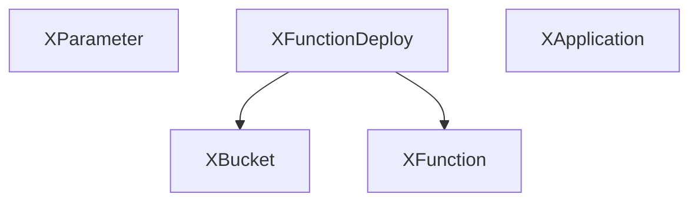

# platform-ref-lambda

This repository defines a [Crossplane configuration package](https://docs.crossplane.io/v1.11/concepts/packages/#configuration-packages) that demonstrates provisioning and invoking
AWS Lambda Functions.

## Composition Overview

The example platform supports the use case of querying SSM parameters via a Lambda
function and using the output values for infrastructure provisioning. Application
teams store their primary and backup regions into SSM, and when they provision
infrastructure Crossplane will invoke a Lambda to extract the regions and
use them to create a pair of VPCs.

The Infrastructure team deploys and manages the Lambda infrastructure using the
following Compositions:



- [XParameter](apis/XParameter/): create SSM parameters
- [XFunctionDeployment](apis/XFunctionDeployment/): creates a Lambda function using the following building blocks:
  - [XBucket](apis/XBucket/): creates an S3 bucket to store Lambda Zip files
  - [XFunction](apis/XFunction/): creates a Lambda function and IAM permissions
  
Application teams use the serverless infrastructure to query SSM for their cloud primary and backup regions.

- [XApplication](apis/XApplication/): creates two VPCs based on the regions stored in SSM

## Deploying the Reference Platform

First you will need access to a Kubernetes cluster. Ensure you are
using the correct context:

```sh
kubectl config current-context
```

Next, we'll use the `up` binary to install UXP, Upbound's distribution of
Crossplane. To get `up`, follow the [installation instructions](https://docs.upbound.io/uxp).

To install UXP using `up` run:

```console
up uxp install
UXP 1.12.1-up.1 installed
```

Install the AWS Provider:

```console
kubectl apply -f examples/provider-aws-scoped.yaml

provider.pkg.crossplane.io/upbound-release-candidates-provider-family-aws created
provider.pkg.crossplane.io/provider-aws-iam created
provider.pkg.crossplane.io/provider-aws-ec2 created
provider.pkg.crossplane.io/provider-aws-lambda created
provider.pkg.crossplane.io/provider-aws-ec2 configured
provider.pkg.crossplane.io/provider-aws-ssm created
```

You can keep track of the provider install:

```console
kubectl get -f examples/provider-aws-scoped.yaml  
```

All the providers should be `INSTALLED` and `HEALTHY` within a minute or two:

```console
NAME                                             INSTALLED   HEALTHY   PACKAGE                                                                  AGE
upbound-release-candidates-provider-family-aws   True        True      xpkg.upbound.io/upbound-release-candidates/provider-family-aws:v0.37.0   110s
provider-aws-iam                                 True        True      xpkg.upbound.io/upbound-release-candidates/provider-aws-iam:v0.37.0      110s
provider-aws-ec2                                 True        True      xpkg.upbound.io/upbound-release-candidates/provider-aws-ec2:v0.37.0      110s
provider-aws-lambda                              True        True      xpkg.upbound.io/upbound-release-candidates/provider-aws-lambda:v0.37.0   110s
provider-aws-ec2                                 True        True      xpkg.upbound.io/upbound-release-candidates/provider-aws-ec2:v0.37.0      110s
provider-aws-ssm                                 True        True      xpkg.upbound.io/upbound-release-candidates/provider-aws-ssm:v0.37.0      110s
```

Next, install the CompositeResourceDefinitions and Compositions:

```console
kubectl apply -f apis/XApplication -f apis/XBucket -f apis/XFunction -f apis/XFunctionDeployment -f apis/XParameter
```

The Custom Platform APIs are Kubernetes `CompositeResourceDefinition` objects or `XRD`
for short. We can list them using `kubectl`:

```console
kubectl get xrd
```

The following XRDs should be `ESTABLISHED` and `OFFERED`:

```console
NAME                                      ESTABLISHED   OFFERED   AGE
xapplications.example.upbound.io          True          True      3m24s
xbuckets.example.upbound.io               True          True      3m23s
xfunctiondeployments.example.upbound.io   True          True      3m23s
xfunctions.example.upbound.io             True          True      3m23s
xparameters.example.upbound.io            True          True      3m23s
```

## Authenticating to AWS

Now that Crossplane, the Provider and all the Compositions are installed we
need to give the provider AWS credentials. This is done by creating a `ProviderConfig`.

There are many options we can use to authenticate to AWS, but to sim

```sh
kubectl create secret generic aws-creds -n upbound-system --from-file=creds=./creds.conf
```

### Configure the Provider with AWS Credentials

We will create the following `ProviderConfig` object to use the AWS credentials
from the previous step. See [AUTHENTICATION](https://github.com/upbound/provider-aws/blob/main/AUTHENTICATION.md) for more authentication options like IRSA.

```yaml
apiVersion: aws.upbound.io/v1beta1
kind: ProviderConfig
metadata:
  name: default
spec:
  credentials:
    source: Secret
    secretRef:
      namespace: upbound-system
      name: aws-creds
      key: creds
```

```console
kubectl apply -f examples/providerconfig-creds.yaml
```

We're now ready to deploy the examples.

## Populating Values in SSM

First, each team is going to store their primary and secondary regions in SSM.

To store an SSM parameter, a namespace-scoped `Parameter` Claim is applied to the cluster:

```yaml
apiVersion: example.upbound.io/v1alpha1
kind: Parameter
metadata:
  name: primary-region
  namespace: team-1
spec:
  parameters:
    providerConfigName: default
    region: us-east-1
    insecureValue: us-east-1
    parameterName: /team-1/primaryRegion
    tags:
      owner: team-1
```

Using files in the `examples` directory:

```console
kubectl apply -f examples/namespace-team1.yaml
kubectl apply -f examples/namespace-team2.yaml
kubectl apply -f examples/ssmparameters-team1.yaml
kubectl apply -f examples/ssmparameters-team2.yaml
```

Applying the examples to the cluster would create Kubernetes objects similar
to the following:

```console
kubectl get Parameter
```

```console
NAMESPACE   NAME             SYNCED   READY   CONNECTION-SECRET   AGE
team-1      backup-region    True     False                       14s
team-1      primary-region   True     False                       14s
team-2      backup-region    True     False                       69s
team-2      primary-region   True     False                       69s
```

## Deploying the Lambda Infrastructure

To deploy the Lambda Function and other Resources, apply the following manifest:

```sh
kubectl apply -f examples/ssm-parameter-lambda-deployment.yaml
```

## Deploying the Application Claims

Finally, we can deploy our Applications.

```console
kubectl apply -f examples/application-team1.yaml 
kubectl apply -f examples/application-team2.yaml 
```

Confirm the VPCs were created in the regions pulled from SSM.

```console
kubectl get vpc -o jsonpath='{range .items[*]}{.metadata.name}{"\t"}{.spec.forProvider.region}{"\n"}'
```

```console
team-1-app-4fgxf-9ps5g  us-west-1
team-1-app-4fgxf-s457t  us-east-1
team-2-app-l8k9v-25nx6  eu-north-1
team-2-app-l8k9v-c6gkg  eu-central-1
```

## Cleaning Up

To Clean up the installation, run the following commands:

```console
kubectl delete -f examples/application-team1.yaml -f examples/application-team2.yaml
kubectl delete -f examples/ssmparameters-team1.yaml -f examples/ssmparameters-team2.yaml
kubectl delete -f examples/namespace-team1.yaml -f examples/namespace-team1.yaml 
kubectl delete -f examples/ssm-parameter-lambda-deployment.yaml
```

Wait for all the cloud resources to be deleted:

```console
kubectl get managed
```

Delete the Compositions, Providers, and ProviderConfig after all the resources have been deleted.

```console
kubectl delete -f apis/XApplication -f apis/XBucket -f apis/XFunction -f apis/XFunctionDeployment -f apis/XParameter
kubectl delete -f examples/providerconfig-creds.yaml
kubectl delete -f examples/provider-aws-scoped.yaml
```

```console
kubectl delete secret -n upbound-system aws-creds
```

## Local Development

This reference platform is a starting point to help you build your own
Platform APIs.

The following sections will detail how to make, test, and publish
modifications to these compositions.

### Setting Up the Build Environment

Clone this repository:

```console
git clone https://github.com/upbound/platform-ref-lambda
```

Next pull in the Upbound [build](https://github.com/upbound/build) as a git submodule:

```console
cd platform-ref-aws
make submodules
Submodule 'build' (https://github.com/upbound/build) registered for path 'build'
Cloning into '/home/user/platform-ref-lambda/build'...
Submodule path 'build': checked out '292f958d2d97f26b450723998f82f7fc1767920c'
```

Next run `make`. This will download the required components:

```sh
make
```

### Applying your Updated Compositions to a Cluster

### Automated Testing Using Uptest

[Uptest](https://github.com/upbound/uptest) is used for end to end testing of the
Compositions in this repository. It does this by provisioning example claims and
waiting for them to become `READY`.

To run uptest locally, first set the `UPTEST_CLOUD_CREDENTIALS` environment variable
with the contents of an AWS credentials file:

```sh
export UPTEST_CLOUD_CREDENTIALS=$(cat ~/.aws/credentials)
```

With the credentials file of the following format:

```ini
[default]
aws_access_key_id=AKIA...
aws_secret_access_key=jQplCPbh...
```

```sh
make e2e
```

## Questions?

For any questions, thoughts and comments don't hesitate to reach out or drop by slack.crossplane.io, and say hi!
